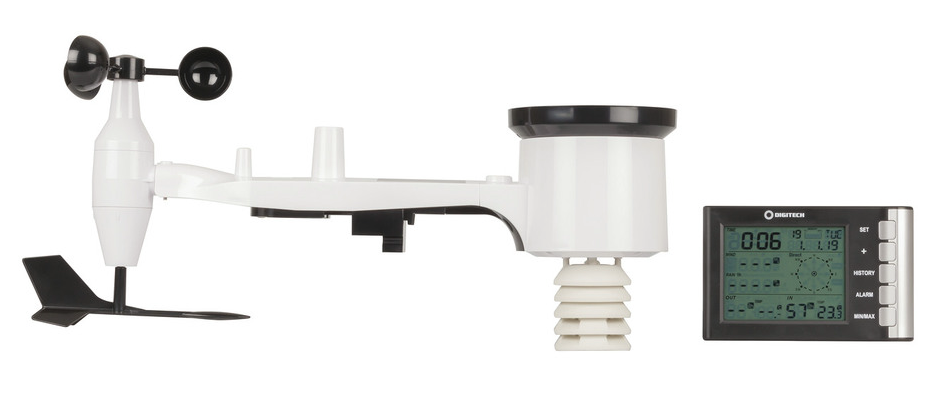

# Weather station decoder

Author: Matt Way March 2024 (https://github.com/matt-kiwi)<br />

## The SeeedStudio CapSense One is a rugged RS-485 Weather station<br />

This python script polls the RS485 sensor once every five minutes ( settable by adding a cron job ).<br />
This script was written for and tested with a Raspberry Pi, but should work on other Linux machines.<br />


#### [XC0400-manualMain.pdf](docs/XC0400-manualMain.pdf)<br />



# Installation notes (incomplete)<br />

Update Linux with APT system
```BASH
apt-get update
apt-get upgrade
```

Check python version is geater than 3.1
```BASH
Python -V
```

Install pip
```BASH
apt-get install pip
```

Install required Python modules for weather station<br />
```BASH
pip install paho.mqtt pyyaml influxdb-client
```

<br>